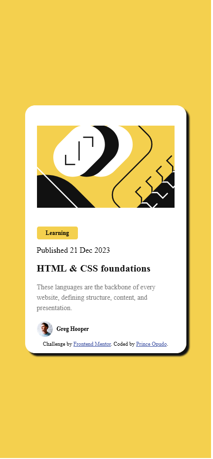

# Frontend Mentor - Blog preview card solution

This is a solution to the [Blog preview card challenge on Frontend Mentor](https://www.frontendmentor.io/challenges/blog-preview-card-ckPaj01IcS).

## Table of contents

- [Overview](#overview)
  - [The challenge](#the-challenge)
  - [Screenshot](#screenshot)
  - [Links](#links)
- [My process](#my-process)
  - [Built with](#built-with)
  - [What I learned](#what-i-learned)
  - [Useful resources](#useful-resources)
- [Author](#author)

## Overview

### The challenge

Users should be able to:

- See hover and focus states for all interactive elements on the page

### Screenshot




### Links

- Solution URL: [Add solution URL here](https://your-solution-url.com)
- Live Site URL: [Add live site URL here](https://your-live-site-url.com)

## My process

### Built with

- Semantic HTML5 markup
- CSS custom properties
- Flexbox
- Mobile-first workflow

### What I learned

-Responsive web design,making the card to adopt depending on the user device.
-Making the images responsive by adding a max-width property on them

```
img{
	max-width:100%;
	display:block;
}
``` 

-Css transitions-making the link transition smoothly by adding transition timing function

```
 transition: .2s ease-in;
```
### Useful resources

- [Web.dev](https://web.dev/learn/design/responsive-images) - This article helped me understand how to make images responsive.I would recommend it to anyone still learning this concept.

- [Conquering ressponsive layouts](https://courses.kevinpowell.co/conquering-responsive-layouts) - This is an amazing course by Kevin Powell it helped me greatly to level up my responsive design concepts.

## Author
- Frontend Mentor - [@codecrasher](https://www.frontendmentor.io/profile/codecrasher)
- Twitter - [@opudoprince](https://www.twitter.com/opudoprince)
